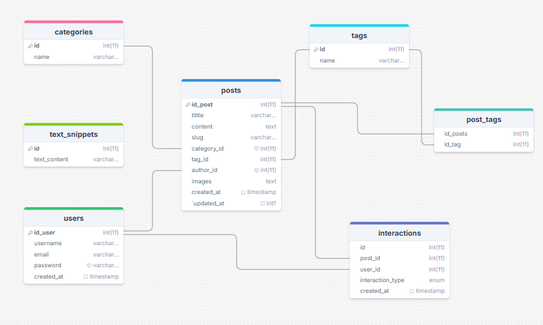

# SMASTIC Blog (Protoype)

Developing a school blog website along with an admin application for content management and user management.

---

## 📋 Features
- Admin Blog Panel (CRUD Blog Content)
- Authentication (Sign Up, Sign In)
- Interaction (Like, Dislike, Comment)
- Search Articles

---

## 🛠️ Tech Stack
- **Backend**: PHP 8.3+
- **Database**: MySQL
- **Frontend**: Tailwind CSS, Javascript
- **Deployment**: [Infinityfree](https://www.infinityfree.com/)

## ERD (Entity Relationship Diagram)

## Try Live Demo Here!
[prototype-smasticblog.ct.ws](https://prototype-smasticblog.ct.ws/index.php)

