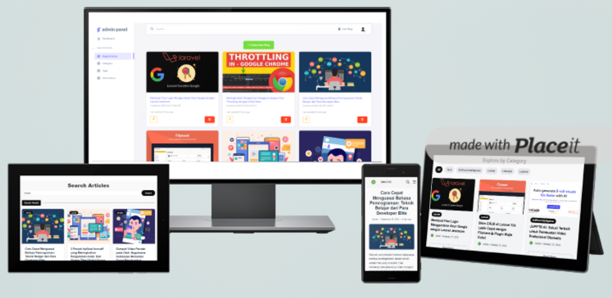

# SMASTIC Blog (Protoype)

Developing a school blog website along with an admin application for content management and user management.

---

## 📋 Features
- Admin Blog Panel (CRUD Blog Content)
- Authentication (Sign Up, Sign In)
- Interaction (Like, Dislike, Comment)
- Search Articles
---
_Note: Sign in/Sign up first to can get use the Interaction Features and get access into admin dashboard (view only) in profile page_

---

## 🛠️ Tech Stack
- **Backend**: PHP 8.3+
- **Database**: MySQL
- **Frontend**: Tailwind CSS, Javascript
- **Deployment**: [Infinityfree](https://www.infinityfree.com/)

## Other Tools & Resources:
- **Web Mockup**: [Placeit.net](https://placeit.net/)
- **Dashboard Template (Admin)**: [Themewagon](https://themewagon.com/themes/free-responsive-bootstrap-5-html5-admin-template-sneat/)
- **ERD Diagram**: [Drawsql](https://drawsql.app/)
- **Local Server**: [XAMPP](https://www.apachefriends.org/)
- **Project Management**: [Notion](https://www.notion.com/)

## ERD (Entity Relationship Diagram)

## Try Live Demo Here!
[prototype-smasticblog.ct.ws](https://prototype-smasticblog.ct.ws/index.php)

